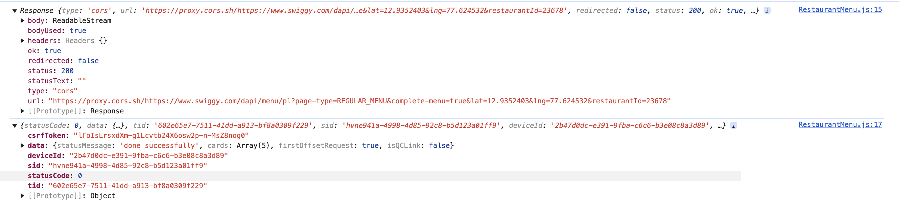

1. Add React Router, and its configuration
2. Create and Add About us, Contact us pages, and render them based on the path (RouterProvider, createBrowserRouter)
3. Add 404 Page not found and error handling using hook from react-router package . (errorElement, useRouteError - to catch the error in the component)
4. Make header intact for all the pages, just change the body to about or contact . (Use Outlet from react-router package)
5. Link vs anchor tag(<a>) : When Clicked on anchor tag, whole page refreshes, while using Link to="/", only the specific path component gets rendered
6. Client Side Routing vs Server Side Routing - Learn about it more
   We are using Client Side Routing in our react app, where the components is getting interchanged
7. Dyanamic Routing for the pages

   - Not Related - add add to cart button in Taigan website ( that will add or subtract in cart)

### Question. Why do we do result.json() after fetching the result using fetch() ?

```
const result = await fetch(RESTAURANT_MENU_URL);
console.log(result);
const data = await result.json();
console.log(data);

```

what does .json() do??

##### Answer:

In JavaScript, when you use the fetch API to retrieve data from a server, you get a Response object. This object contains information about the response, such as the status code, headers, and the actual body of the response.

The .json() method is a built-in function on the Response object that parses the response body as JSON. It returns a Promise that resolves to the parsed JavaScript object (or array, depending on the data).


