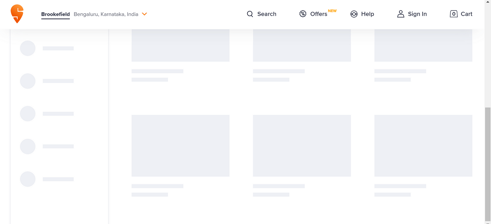

1. Take Data from API (- fetch, useEffect hook)

- useEffect will execute after the component is rendered.
- useEffect will render the function context based on the dependecy array passed.

  - useEffect(()=>{},[]); -> it will execute the function only once
  - useEffect(()=>{},[anyVariable, variable2]); -> it will execute the function everytime the state variable changes
  - not giving any argument useEffect(()=>{}); -> it will execute every time component gets re-render.

- Every time a state change happen to any variable-> the components itself gets re-render. Reconcillation is triggered, and it will check the old virtual DOM with the new Virtual DOM , and uses the diff algorithm , and found the difference in the DOMs, then it will do the actual DOM manipulation to only that elemnt that is different.

2. Use Shimmer UI

- As we make any api call to fetch the data, to show it in UI, we uses this format
  Load Page -> Render the UI. -> Make API Call -> Render UI again with latest data

- In the meantime the data is getting fetched from the API , the user will either see a blank page or Loading icon, but that is not a good user experience for the user. So the concept of shimmer ui comes into play. Shimmer UI will show fake blank cards, that will let user know that there will cards displaying in this page or something like that, it is now generally used in many website.

3. Make Search Functionality -> useState

4. CORS -> when we try to fetch from an api that is having different domain name, the browser will block the call and give CORS issue, to solve that we can use extension in our chrome for the meantime. (Allw CORS extension)

5. Conditional Rendering - > when we render data based on some condition, like when data is there show actual cards, else show shimmer ui.

6. Add login/logout button using setState

7. Optiional Chaining

- data?.abcd?.efgh?.quantity

8. CORS Proxy .io
