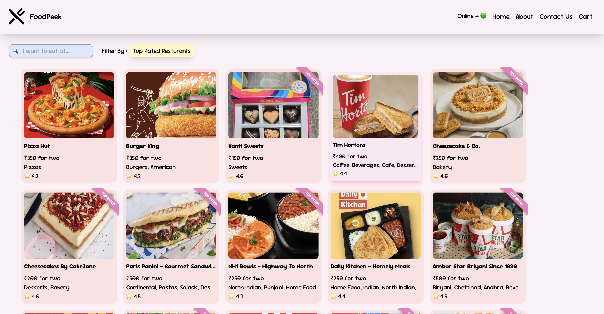

<p align="center"></p>
<p align="center"> </p>

<h3 align="center">Food Delivery Application 🛒 (React and NestJS)!</h3>


🚀 FoodPeek is a React based food delivery application.

Hosted **on [FoodPeek.vercel.app](https://FoodPeek.vercel.app),** this application brings a hassle-free way to explore and order from restaurants.


# Docs

- [Example](#example)
- [Features](#-features)
- [Future Enhancements](#-future-enhancements)
- [Tech Stack](#-tech-stack)
- [Live Demo](#-live-demo)
- [Project Local Setup](#-project-local-setup)
- [Contributing](#-contributing)
- [License](#-license)


# Example

<p align="center">
<a href="https://FoodPeek.vercel.app">

</a>
</p>

https://github.com/user-attachments/assets/f34480c0-6c0a-4e66-8d9b-8f8977898d9b

<!-- <p align="center"></p> -->

# 🌟 Features

### ✅ Real-Time API Integration

- **Live Swiggy APIs** for accurate menus, availability, and promotions.

### ⚡ Optimized Performance

- **Lazy Loading & Code Splitting** to enhance loading times and responsiveness.
- **Shimmer UI** for smooth loading effects.

### 🔧 Efficient State Management

- **Redux Toolkit** for centralized state management, ensuring a seamless experience.
- **Custom Hooks** to improve code reusability and maintainability.

### 🔍 Advanced Search & Filtering

- **Search Functionality** to quickly find restaurants and dishes.
- **Filtering Options** based on cuisine, ratings, and offers.

### 🚀 Smooth User Experience

- **React Router DOM** for seamless navigation.
- **Detailed Restaurant Pages** with menus, reviews, and delivery estimates.
- **404 Error Page** for handling navigation issues gracefully.
- **Completely Responsive** design for an optimal experience on any device.


# 🎯 Future Enhancements

- 🌐 **Multi-Language Support**: Navigate in your preferred language.
- 🌙 **Dark Mode**: A sleek, user-friendly dark theme.
- 📍 **Location-Based Personalization**: Custom delivery location setup.
- 🛒 **Enhanced Add-to-Cart & Checkout**: Smoother ordering process.
- 💳 **Secure Payments**: Seamless and secure transactions.
- 🔐 **User Authentication**: Login/Sign-in with personalized services.


# 💻 Tech Stack

- **Frontend:** React, Redux Toolkit, Tailwind CSS, React Router
- **Backend:** Node.js, Express.js
- **Bundler:** Parcel
- **Hosting:** Vercel


# 🚀 Live Demo

[🌍 FoodPeek Live](https://FoodPeek.vercel.app)


# 📂 Project Local Setup

### 1. Clone the Repository

```bash
git clone https://github.com/droidbg/FoodPeek.git
cd FoodPeek
```

### 2. Start Server

```sh
cd server
npm install
npm start
```

### 3. Start React App

```bash
cd ../client
npm install
npm start
```

### 4. Set Up Environment Variables

Create a `.env` file in the client directory and add the following variables:

```env
# CORS key
API_KEY=your_cors_here


# Database URL (Posgres by default)
DATABASE_URL=your_db_url
```

<!--
## API Endpoints

### Categories

- **Create a Category**:

  - `POST /categories/`
  - Request Body:
    ```json
    {
      "name": "Electronics",
      "description": "Reviews for electronic products"
    }
    ```

- **Get All Categories**:
  - `GET /categories/`

### Reviews

- **Create a Review**:

  - `POST /reviews/`
  - Request Body:
    ```json
    {
      "text": "This product is amazing!",
      "stars": 9,
      "review_id": "12345",
      "category_id": 1
    }
    ```

- **Get All Reviews**:

  - `GET /reviews/`
  - Optional Query Parameter: `category_id` (filter reviews by category)
  - Pagination: 15 reviews per page.

- **Reprocess Reviews**:
  - `POST /reviews/reprocess`
  - Reprocesses all reviews with missing sentiment or tone analysis.

### Trends

- **Get Review Trends**:
  - `GET /reviews/trends`
  - Returns top 5 categories based on average review ratings.

---

## Example Usage

### Create a Category

```bash
curl -X POST "http://127.0.0.1:8000/categories/" \
-H "Content-Type: application/json" \
-d '{"name": "Electronics", "description": "Reviews for electronic products"}'
```

### Create a Review

```bash
curl -X POST "http://127.0.0.1:8000/reviews/" \
-H "Content-Type: application/json" \
-d '{"text": "This product is amazing!", "stars": 9, "review_id": "12345", "category_id": 1}'
```

### Get Review Trends

```bash
curl -X GET "http://127.0.0.1:8000/reviews/trends"
```

### Get Reviews by Category

```bash
curl -X GET "http://127.0.0.1:8000/reviews/?category_id=1"
```

--- -->


## 📜 Contributing

We welcome contributions! Feel free to open issues and pull requests.


## 📝 License

This project is licensed under the MIT License.


Enjoy fast, seamless food and grocery delivery with FoodPeek!! 🚀


<!-- This is a food delivery application.

1. For fetching of data we are using swiggy API :
   https://www.swiggy.com/dapi/restaurants/list/v5?lat=12.9351929&lng=77.62448069999999&page_type=DESKTOP_WEB_LISTING

2. Added Cors Proxy using https://cors.sh/

<!--
-> Create a .env file and your CORS Proxy API key in it

-> https://designer.mocky.io/design or create own server on vercel or render.com -->
<!-- #653ADB -->
<!-- #0093fb -->
